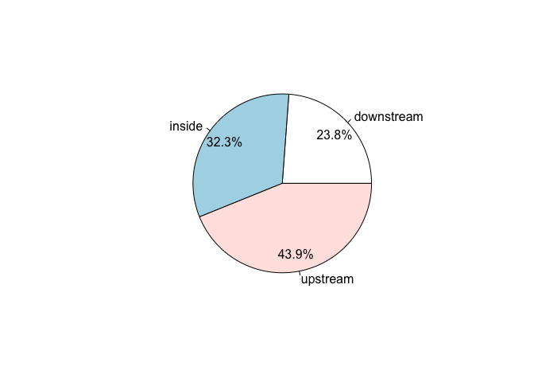
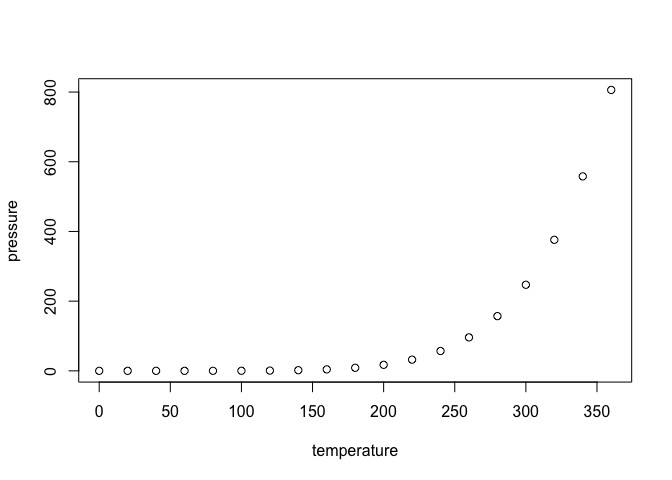

Untitled
================

GitHub Documents
----------------

``` r
# install.packages("tidyverse")
# source("http://bioconductor.org/biocLite.R")
# BiocManager::install("ChIPpeakAnno")
# BiocManager::install("EnsDb.Mmusculus.v79")
# BiocManager::install("org.Mm.eg.db")
# BiocManager::install("BSgenome.Mmusculus.UCSC.mm10")
# BiocManager::install("rGADEM")
# BiocManager::install("Biostrings") 
# BiocManager::install("MotIV")
# install.packages("ggseqlogo")
library(ChIPpeakAnno)
library(tidyverse)
library(EnsDb.Mmusculus.v79)
library(org.Mm.eg.db)
library(BSgenome.Mmusculus.UCSC.mm10)
library(rGADEM)
library(Biostrings)
library(MotIV)
library(ggseqlogo)

# set working directory where bed files are
setwd("~/Desktop/20190218_ChIP-seq/bed/") 
```

遺伝子注釈（アノテーション）
----------------------------

現在ピークの情報（BEDファイル）はゲノム座標のみとなっている. ChIPpeakannoを用いてピークに遺伝子情報を付加する．またピークのゲノム上の位置も分かる．

``` r
# convert data type 
path.cDC1.Irf8 <- "~/Desktop/20190218_ChIP-seq/bed/cDC1_IRF8_summits_light_40.bed"
gr.cDC1.Irf8 <- toGRanges(path.cDC1.Irf8, format="BED", header=FALSE)

# get ready for gene annotation
annoData <- toGRanges(EnsDb.Mmusculus.v79)
seqlevelsStyle(gr.cDC1.Irf8) <- seqlevelsStyle(annoData)

## do annotation by nearest TSS
anno <- annotatePeakInBatch(gr.cDC1.Irf8, AnnotationData = annoData)

# A pie chart can be used to demonstrate the overlap features of the peaks.
pie1(table(anno$insideFeature))
```



``` r
# adding gene symbol
anno <- addGeneIDs(anno, orgAnn = "org.Mm.eg.db", 
                   feature_id_type = "ensembl_gene_id",
                   IDs2Add = c("symbol"))
head(anno[1:5]) # gene symbol added
```

    ## GRanges object with 5 ranges and 11 metadata columns:
    ##                                          seqnames    ranges strand |
    ##                                             <Rle> <IRanges>  <Rle> |
    ##   cDC1_IRF8_peak_7761.ENSMUSG00000039452     chr9  66082179      * |
    ##   cDC1_IRF8_peak_6731.ENSMUSG00000085238     chr6 146675271      * |
    ##   cDC1_IRF8_peak_3700.ENSMUSG00000071042    chr17  75472517      * |
    ##   cDC1_IRF8_peak_4369.ENSMUSG00000035829     chr2  28402359      * |
    ##   cDC1_IRF8_peak_7634.ENSMUSG00000034908     chr9  45962023      * |
    ##                                              score                peak
    ##                                          <numeric>         <character>
    ##   cDC1_IRF8_peak_7761.ENSMUSG00000039452 157.73901 cDC1_IRF8_peak_7761
    ##   cDC1_IRF8_peak_6731.ENSMUSG00000085238 149.05202 cDC1_IRF8_peak_6731
    ##   cDC1_IRF8_peak_3700.ENSMUSG00000071042 137.63701 cDC1_IRF8_peak_3700
    ##   cDC1_IRF8_peak_4369.ENSMUSG00000035829 136.89536 cDC1_IRF8_peak_4369
    ##   cDC1_IRF8_peak_7634.ENSMUSG00000034908 134.49788 cDC1_IRF8_peak_7634
    ##                                                     feature start_position
    ##                                                 <character>      <integer>
    ##   cDC1_IRF8_peak_7761.ENSMUSG00000039452 ENSMUSG00000039452       66065176
    ##   cDC1_IRF8_peak_6731.ENSMUSG00000085238 ENSMUSG00000085238      146657218
    ##   cDC1_IRF8_peak_3700.ENSMUSG00000071042 ENSMUSG00000071042       75435905
    ##   cDC1_IRF8_peak_4369.ENSMUSG00000035829 ENSMUSG00000035829       28446800
    ##   cDC1_IRF8_peak_7634.ENSMUSG00000034908 ENSMUSG00000034908       45937857
    ##                                          end_position feature_strand
    ##                                             <integer>    <character>
    ##   cDC1_IRF8_peak_7761.ENSMUSG00000039452     66069731              -
    ##   cDC1_IRF8_peak_6731.ENSMUSG00000085238    146665403              +
    ##   cDC1_IRF8_peak_3700.ENSMUSG00000071042     75529043              +
    ##   cDC1_IRF8_peak_4369.ENSMUSG00000035829     28455508              +
    ##   cDC1_IRF8_peak_7634.ENSMUSG00000034908     45955247              -
    ##                                          insideFeature distancetoFeature
    ##                                               <factor>         <numeric>
    ##   cDC1_IRF8_peak_7761.ENSMUSG00000039452      upstream            -12448
    ##   cDC1_IRF8_peak_6731.ENSMUSG00000085238    downstream             18053
    ##   cDC1_IRF8_peak_3700.ENSMUSG00000071042        inside             36612
    ##   cDC1_IRF8_peak_4369.ENSMUSG00000035829      upstream            -44441
    ##   cDC1_IRF8_peak_7634.ENSMUSG00000034908      upstream             -6776
    ##                                          shortestDistance
    ##                                                 <integer>
    ##   cDC1_IRF8_peak_7761.ENSMUSG00000039452            12448
    ##   cDC1_IRF8_peak_6731.ENSMUSG00000085238             9868
    ##   cDC1_IRF8_peak_3700.ENSMUSG00000071042            36612
    ##   cDC1_IRF8_peak_4369.ENSMUSG00000035829            44441
    ##   cDC1_IRF8_peak_7634.ENSMUSG00000034908             6776
    ##                                          fromOverlappingOrNearest
    ##                                                       <character>
    ##   cDC1_IRF8_peak_7761.ENSMUSG00000039452          NearestLocation
    ##   cDC1_IRF8_peak_6731.ENSMUSG00000085238          NearestLocation
    ##   cDC1_IRF8_peak_3700.ENSMUSG00000071042          NearestLocation
    ##   cDC1_IRF8_peak_4369.ENSMUSG00000035829          NearestLocation
    ##   cDC1_IRF8_peak_7634.ENSMUSG00000034908          NearestLocation
    ##                                                 symbol
    ##                                            <character>
    ##   cDC1_IRF8_peak_7761.ENSMUSG00000039452         Snx22
    ##   cDC1_IRF8_peak_6731.ENSMUSG00000085238 4930479D17Rik
    ##   cDC1_IRF8_peak_3700.ENSMUSG00000071042       Rasgrp3
    ##   cDC1_IRF8_peak_4369.ENSMUSG00000035829       Ppp1r26
    ##   cDC1_IRF8_peak_7634.ENSMUSG00000034908         Sidt2
    ##   -------
    ##   seqinfo: 20 sequences from an unspecified genome; no seqlengths

``` r
# export anootated data to txt file
write.table(anno, file = "cDC1.Irf8.annotation.txt")
# data <- read.delim("cDC1.Irf8.annotation.txt", sep = "")
```

GO解析
------

GO解析はRでも可能だが, 少し煩雑なので今回はGUIで使えるwebサービス[GREAT](http://great.stanford.edu/public/html/)を使用する. This is an R Markdown format used for publishing markdown documents to GitHub. When you click the **Knit** button all R code chunks are run and a markdown file (.md) suitable for publishing to GitHub is generated.

Including Code
--------------

You can include R code in the document as follows:

``` r
summary(cars)
```

Including Plots
---------------

You can also embed plots, for example:



Note that the `echo = FALSE` parameter was added to the code chunk to prevent printing of the R code that generated the plot.
